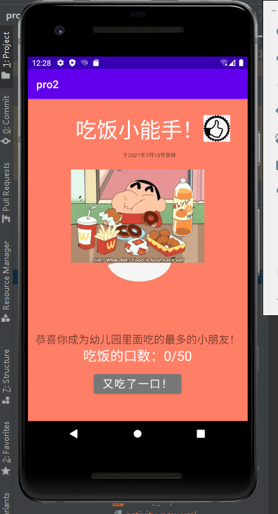

# Day2

内部含有

## pro2 文件

由本人参考上课pdf，教师锁提供的demo文件与网上部分资料进行编写

主页一共有六个按钮，分别具有不同的功能

* **my act** 按钮可以通过点击跳转到编写的**myactivity**界面
  * 在此界面中有按钮和toast的交互
* **pra act** 按钮可以通过点击跳转到编写的**practiceactivity**界面
* **baidu** 按钮可以通过点击跳转到某一个浏览器打开的百度搜索引擎
* **dial** 按钮可以通过点击跳转到手机自身的拨号界面
* 下方的**UIPage** 按钮是自己编写制作的一个交互界面
  * 其中包括多种空间进行交互
  * 用户可以通过点击下方的按钮来进行吃饭口数的增加
* 下方的**Recycle** 按钮是跳转到自己编写的一个滑动列表界面
  * 其由上方的图片和下方的滑动列表组成
  * 由于能力与时间有限，并没有进行记录的添加和删除，仅仅完成了滑动列表的基本功能和抖音仿真界面的实现

## 截图

* UI页面

* 热搜界面

