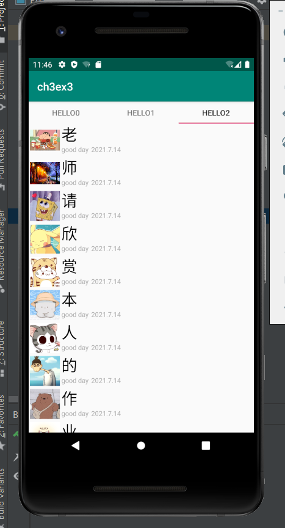
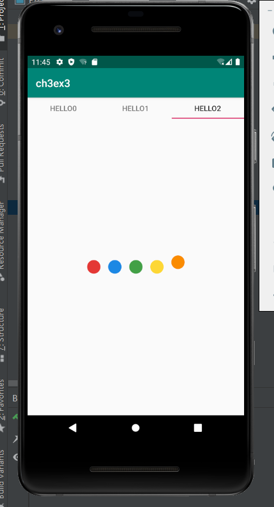

# Day3

内部含有

## pro3 文件

由本人参考上课pdf，教师锁提供的demo文件与网上部分资料进行编写

主页一共有三个按钮，跳转之后分别对应三个作业

* 第一个通过setprogress函数进行播放进度的调整
* 第二个通过建立动画并绑定现有动画实现矩形的缩放与颜色和透明度的变化
* 最后一个作业较为复杂：
  * 最外层通过组合动画效果和fragment模块实现延迟进入的效果
  * fragment通过tablayout元件和Viewpager组合而成
  * 而viewpager是通过recyclist进行实现（使用前一节课所学的）

## 第三个作业的截图

* UI页面
  * 

* 热搜界面
  * 
