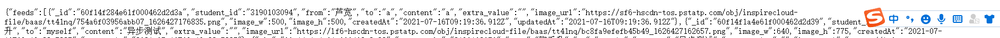
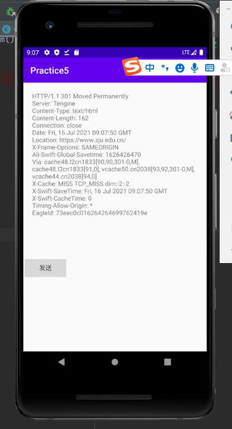

# Day5

内部含有

## pro5 文件

由本人参考上课pdf，教师锁提供的demo文件与网上部分资料进行编写了关于三个要求的实现

* 首先通过用HttpUrlConnection实现获取留言列表数据
* 然后通过Retrofit 的异步接⼝⽅式实现提交留⾔
* 最后⽤Socket的⽅式实现简单Head请求

### 截图

* 提交成功的UI界面
  * 
* 提交成功再次调取返回的清单
  * 
* socket接受请求
  * 

